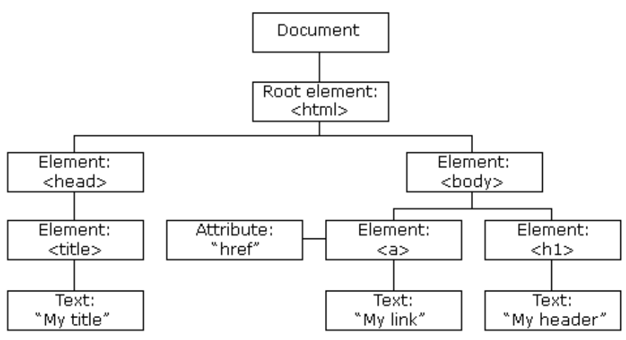
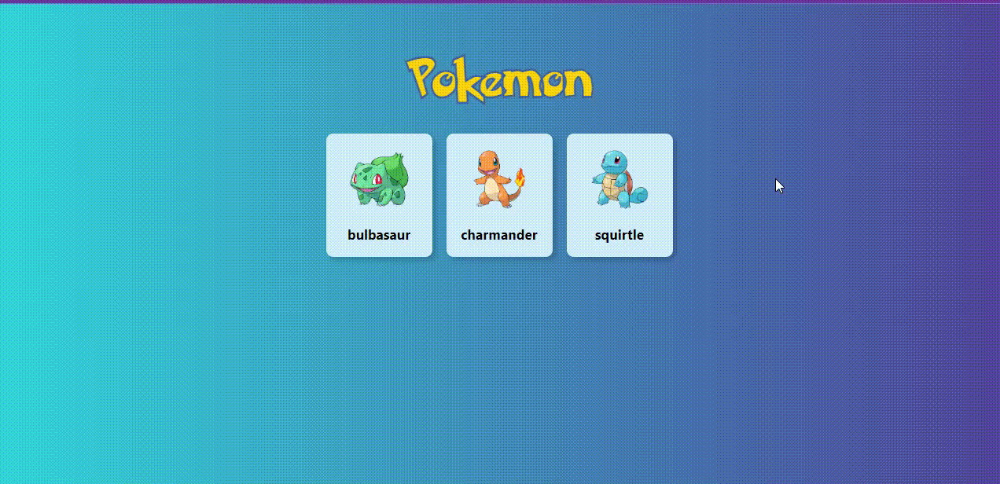
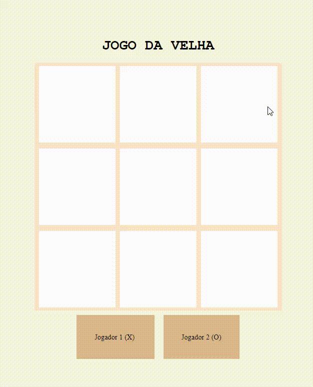

### Front-End - Introdução ao Javascript


<details>
<summary>1 - DOM</summary>

> O Modelo de Documento por Objetos é uma convenção multiplataforma e independente de linguagem de programação, fiscalizada pelo entidade World Wide Web Consortium, para representação e interação com objetos em documentos HTML, XHTML e, XML.

> Veremos como adicionar dinamismo e interatividade ao front-end utilizando Javascript. Vamos aprender a criar eventos para incluir funcionalidades em nossa aplicação, e a trabalhar com o DOM (Document Object Model) para manipular elementos do HTML  de forma prática.



</details>

<details>
<summary>2 - Vinculação do JS</summary>

- Existe duas formas de vincular o JS no arquivo `HTML`:
```html
<!DOCTYPE html>
<html lang='en'>

    <head>
        <title>Vinculação do JS</title>
        <!--2º forma de chamar o JS-->
        <script defer src='./script.js'></script>
    </head>

    <body>
        <h1>Javascript</h1>
        <p>Lorem ipsum, dolor sit amet consectetur adipisicing elit. Exercitationem dolore ea magni nam iusto maiores
            obcaecati dolor est. A in impedit ipsam incidunt vero, et reprehenderit voluptatem aliquam harum suscipit.
        </p>
    </body>


    <!--1º forma de chamar o JS-->
    <script>
        console.log('1º forma de chamar o JS');
        // alert('1º forma de chamar o JS')
    </script>

</html>

```

- Boas práticas
  - Uma boa prática é colocar a tag `script` com nosso arquivo js no final do corpo do nosso HTML, para que o documento já esteja carregado no momento em que o script for lido. Dessa forma, o carregamento do script não atrasa o restante da página.
  - Também existe o atributo `defer`
    - O atributo defer diz ao navegador para executar o script apenas quando a análise do HTML estiver finalizada. O script será requisitado assincronamente, seu download será completado e, apenas quando a análise do documento HTML estiver finalizada, ele será executado.
    - Possibilitando usar a tag `script` dentro do head sem comprometer o carregamento do `HTML`


</details>

<details>
<summary>3 - Evento onclick</summary>

> O evento onclick executa determinada funcionalidade quando um botão é clicado. Isso pode ocorrer quando um usuário envia um formulário, quando você altera determinado conteúdo na página da web e assim por diante. Você coloca a função em JavaScript que você quer executar dentro da tag de abertura do botão.

```html
<!DOCTYPE html>
<html lang='en'>

    <head>
        <title>Evento onclick</title>
        <!--2º forma de chamar o JS-->
        <script defer src='./script.js'></script>
    </head>

    <body>
        <button onclick='click()'>Clique aqui</button>
    </body>
</html>
```

```js
function click() {
    alert('Você clicou!');
}
```

</details>

<details>
<summary>4 - DOM Seletores</summary>

> Para acessar os elementos de uma página, usamos seletores. Cada seletor pode retornar um único elemento ou uma lista de elementos.

> Para fazer uso dos seletores, devemos fazer uso do objeto document, uma vez que os seletores são métodos dele.

> Os seletores, são funções que recebe uma String que indica o seletor CSS que estamos procurando. 

- querySelector
> Ele retornará o primeiro elemento do HTML que contém a classe 'título'. 

```html
<!DOCTYPE html>
<html lang='en'>

    <head>
        <title>querySelector</title>
        <!--2º forma de chamar o JS-->
        <script defer src='./script.js'></script>
    </head>

    <body>
        <h1 class='title'>Javascript</h1>
        <p class='description'>Lorem ipsum, dolor sit amet consectetur adipisicing elit. Exercitationem dolore ea magni nam iusto maiores
            obcaecati dolor est. A in impedit ipsam incidunt vero, et reprehenderit voluptatem aliquam harum suscipit.
        </p>

        <ul class='list'>
            <li class='item'>Goiaba</li>
            <li class='item'>Banana</li>
            <li class='item'>Uva</li>
        </ul>
    </body>

</html>
```
```js
const title = document.querySelector('.title');

console.log('Isso é um título', title);

const description = document.querySelector('.description');

console.log('Isso é um parágrafo', description);
```

- querySelectorAll
> Ele retornará uma lista de elementos que correspondem à pesquisa especificada. 


```html
<!DOCTYPE html>
<html lang='en'>

    <head>
        <title>querySelectorAll</title>
        <!--2º forma de chamar o JS-->
        <script defer src='./script.js'></script>
    </head>

    <body>
        <ul class='list'>
            <li class='item'>Goiaba</li>
            <li class='item'>Banana</li>
            <li class='item'>Uva</li>
        </ul>
    </body>

</html>
```
```js
const items = document.querySelectorAll('.item');

console.log('Isso é uma lista', items);
```

- getElementById
> Ele retornará o elemento cujo id corresponde ao desejado. 

```html
<!DOCTYPE html>
<html lang='en'>

    <head>
        <title>getElementById</title>
        <!--2º forma de chamar o JS-->
        <script defer src='./script.js'></script>
    </head>

    <body>
        <input id='search' class='search' type='text' >
    </body>

</html>
```
```js
//4 forma diferentes de acessa um elemento no HTML
const search1 = document.querySelector('.search')
const search2 = document.querySelector('#search')
const search3 = document.getElementById('search')
const search4 = document.getElementsByClassName('search')

console.log(search1, search2, search3, search4);
```

|querySelector()|querySelectorAll()|getElementById()|
|---------------|------------------|----------------|
|Retorna o primeiro elemento do DOM que atende à condição que estamos procurando.|Retorna todos os elementos do DOM que atendem à condição que procuramos.|Retorna o elemento do DOM que atende ao Id que estamos procurando.


</details>

<details>
<summary>5 - Modificando o DOM</summary>

> Para fazer modificações no DOM, precisamos ter o objeto que queremos modificar selecionado. Podemos fazer isso usando seletores! 

- innerHTML
> Se quisermos ler ou modificar o conteúdo de uma tag HTML, vamos usar esta propriedade: 

```html
<!DOCTYPE html>
<html lang='en'>

    <head>
        <title>innerHTML</title>
        <!--2º forma de chamar o JS-->
        <script defer src='./script.js'></script>
    </head>

    <body>
        <ul class='list'>
        </ul>
    </body>

</html>
```
```js
const list = document.querySelector('.list');
 
// Irá adicionar novos elementos dentro do seletor list
list.innerHTML += '<li>Item 1</li>';
list.innerHTML += '<li>Item 2</li>';
list.innerHTML += '<li>Item 3</li>';
```

- innerTEXT
> Se quisermos ler ou modificar o texto de uma tag HTML, vamos usar esta propriedade:

```html
<!DOCTYPE html>
<html lang='en'>

    <head>
        <title>innerTEXT</title>
        <!--2º forma de chamar o JS-->
        <script defer src='./script.js'></script>
    </head>

    <body>
        <h1 class='title'>Javascript</h1>
    </body>

</html>
```
```js
const title = document.querySelector('.title');
 
// Irá trocar o conteúdo que é `Javascript` para `JS`
title.innerTEXT = 'JS';
```

- style
> Nos permite ler e sobrescrever as regras CSS que são aplicadas a um elemento que selecionamos. 

```html
<!DOCTYPE html>
<html lang='en'>

    <head>
        <title>style</title>
        <!--2º forma de chamar o JS-->
        <script defer src='./script.js'></script>
    </head>

    <body>
        <h1 class='title'>Javascript</h1>
    </body>

</html>
```
```js
const title = document.querySelector('.title');
 
// Irá trocar o conteúdo que é `Javascript` para `JS`
title.style.color = 'cyan';
title.style.fontSize = '12px';
```

> Observe que as regras CSS que tinham hifens como font-size, em Javascript são escritas em camelCase, ou seja, fontSize. 


</details>

<details>
<summary>6 - Modificando classes</summary>

> O Javascript possui uma propriedade e vários métodos que nos permitem realizar diversas ações com o atributo class de um elemento.

- classList.add()
> Adiciona uma nova classe ao elemento selecionado.

```html
<!DOCTYPE html>
<html lang='en'>

    <head>
        <title>classList.add</title>
        <!--2º forma de chamar o JS-->
        <script defer src='./script.js'></script>
    </head>

    <body>
        <h1 class='title'>Javascript</h1>
        <button onclick='ocultar()'>Ocultar</button>
    </body>

</html>
```
```css
.hidden {
    display: none
}
```
```js
const title = document.querySelector('.title');

function ocultar() {
    title.classList.add('hidden');
}
```

- classList.remove()
> Remove uma classe existente do elemento selecionado.

```html
<!DOCTYPE html>
<html lang='en'>

    <head>
        <title>classList.remove</title>
        <!--2º forma de chamar o JS-->
        <script defer src='./script.js'></script>
    </head>

    <body>
        <h1 class='title'>Javascript</h1>
        <button onclick='ocultar()'>Ocultar</button>
        <button onclick='exibir()'>Exibir</button>
    </body>

</html>
```
```css
.hidden {
    display: none
}
```
```js
const title = document.querySelector('.title');

function ocultar() {
    title.classList.add('hidden');
}

function exibir() {
    title.classList.remove('hidden');
}
```

- classList.toggle()
> Checa se existe uma classe no elemento selecionado. Caso exista, remove a classe do elemento. Caso não, adiciona a classe ao elemento.

```html
<!DOCTYPE html>
<html lang='en'>

    <head>
        <title>classList.toggle</title>
        <!--2º forma de chamar o JS-->
        <script defer src='./script.js'></script>
    </head>

    <body>
        <h1 class='title'>Javascript</h1>
        <button onclick='ocultarExibir()'>Ocultar/Exibir</button>        
    </body>

</html>
```
```css
.hidden {
    display: none
}
```
```js
const title = document.querySelector('.title');

function ocultarExibir() {
    title.classList.toggle('hidden');
}
```

- classList.contains()
> Permite perguntar se um elemento possui determinada classe. Retorna um valor booleano.

```html
<!DOCTYPE html>
<html lang='en'>

    <head>
        <title>classList.contains</title>
        <!--2º forma de chamar o JS-->
        <script defer src='./script.js'></script>
    </head>

    <body>
        <h1 class='title hidden'>Javascript</h1>
        <button onclick='ocultarExibir()'>Ocultar/Exibir</button>        
    </body>

</html>
```
```css
.hidden {
    display: none
}
```
```js
const title = document.querySelector('.title');

if (title.classList.contains('hidden')) {
    alert('Está oculto');
} else {
    alert('Não está oculto');
}
```

|.add()|.remove()|.toggle()|.contains()|
|------|---------|---------|-----------|
|Adiciona a classe ao elemento|Remove a classe do elemento|Adiciona a classe, caso ela não exista. Remove a classe, caso ela já exista.|Pergunta se o elemento possui a classe ou não. Retorna um valor booleano.


</details>

<details>
<summary>7 - Exercícios</summary>

- Prática 1


- Prática 2


- Prática 3



</details>

###### tags: `javascript` `dom` `document` `querySelecton` `querySelectonAll` `innerHTML` `textContent` `classList`
